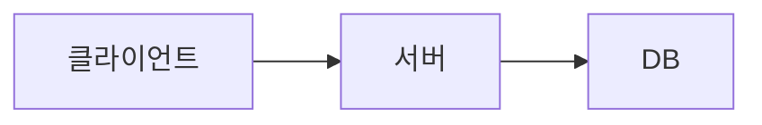

# Markdown — 문법 가이드

## 한 줄 정의

**일반 텍스트로 서식 있는 문서를 작성하는 가벼운 마크업 언어**. 거의 모든 개발자·콘텐츠 작업의 표준 텍스트 포맷.

## 왜 중요한가 (사용자 케이스)

사용자가 마크다운을 만나는 곳:
- **이 위키 자체** (Obsidian)
- **Claude Code** 결과물 (AI가 마크다운으로 답변)
- **GitHub** README·이슈·PR 설명
- **Notion** 일부 호환
- **콘텐츠 작성** (블로그·Substack)
- **AI 프롬프트** (Claude·ChatGPT 입력에 마크다운 자주 사용)

→ 학습 노트 + AI 작업 + 위키 운영 모두에 일상.

## 기본 문법

### 헤더 (제목)

```markdown
# H1 (가장 큰 제목)
## H2
### H3
#### H4
##### H5
###### H6
```

- `#` 개수 = 헤더 단계
- `#` 뒤에 공백 필수
- 한 페이지에 H1은 1개만 권장

### 강조

```markdown
**굵게** 또는 __굵게__
*기울임* 또는 _기울임_
***굵고 기울임***
~~취소선~~
==하이라이트== (일부 지원)
```

표시:
- **굵게**
- *기울임*
- ***굵고 기울임***
- ~~취소선~~

### 목록

**순서 없는 목록**:
```markdown
- 항목 1
- 항목 2
  - 중첩 항목 (스페이스 2개)
  - 중첩 항목
- 항목 3
```

**순서 있는 목록**:
```markdown
1. 첫째
2. 둘째
3. 셋째
```

**체크박스** (작업 목록):
```markdown
- [ ] 안 한 일
- [x] 한 일
```

### 링크

```markdown
[표시 텍스트](https://example.com)
[표시 텍스트](https://example.com "마우스 오버 시 제목")

# 참조 스타일
[표시 텍스트][ref-id]
[ref-id]: https://example.com
```

**Obsidian 위키 링크** (이 위키 표준):
```markdown
[[페이지명]]                  # 같은 이름 페이지로 링크
[[페이지명|보일 텍스트]]       # 별칭으로 표시
[[페이지명#섹션]]             # 특정 섹션
[[페이지명^블록ID]]           # 특정 블록
```

→ 사용자가 매일 쓰는 패턴. 일반 마크다운엔 없는 Obsidian 확장.

### 이미지

```markdown


```

**Obsidian 임베드**:
```markdown
![[이미지파일.png]]
![[다른페이지.md]]            # 다른 페이지 임베드
```

### 코드

**인라인 코드**:
```markdown
이 함수는 `printf()` 형태로 사용합니다.
```

**코드 블록** (3개 백틱):
````markdown
```
일반 코드
```

```python
# 언어 명시 시 syntax highlighting
def hello():
    print("Hi")
```

```bash
$ ls -al
$ cd /home
```
````

→ 언어 이름 다양하게: `python`·`javascript`·`bash`·`sh`·`html`·`css`·`json`·`yaml`·`sql`·`swift`·`go`·`rust` 등.

### 인용

```markdown
> 한 줄 인용

> 여러 줄 인용
> 두 번째 줄
> 
> 빈 줄로 단락 구분

> 중첩 인용
> > 안쪽 인용
```

### 표

```markdown
| 헤더 1 | 헤더 2 | 헤더 3 |
|--------|--------|--------|
| 셀 A   | 셀 B   | 셀 C   |
| 셀 D   | 셀 E   | 셀 F   |
```

**정렬**:
```markdown
| 왼쪽 | 가운데 | 오른쪽 |
|:-----|:------:|------:|
| L    |   C    |     R |
```

- `:---` = 왼쪽 정렬
- `:---:` = 가운데
- `---:` = 오른쪽

### 수평선

```markdown
---
또는
***
또는
___
```

### 줄바꿈

```markdown
한 줄.
다음 줄 (스페이스 2개 끝에)  
또는 빈 줄 후 다음 단락.
```

⚠️ **흔한 오해**: 그냥 엔터 한 번 = 새 줄. → 거짓. 마크다운에서 **빈 줄 없이 엔터만**은 같은 단락으로 처리. **줄 끝에 스페이스 2개** 또는 빈 줄 필요.

### 이스케이프

```markdown
\* 별표를 일반 글자로
\[ 대괄호를 일반 글자로
\\ 백슬래시 자체
```

특수 문자 앞에 `\` = 일반 문자로 처리.

---

## 확장 문법

### GFM (GitHub Flavored Markdown)

GitHub·Obsidian·Notion 일부 지원:

**자동 링크**:
```markdown
https://example.com  → 자동으로 링크
```

**스트라이크스루**:
```markdown
~~취소선~~
```

**이모지** (GitHub):
```markdown
:smile: :thumbsup:  → 😄 👍
```

**작업 목록**:
```markdown
- [x] 완료
- [ ] 진행 중
```

### 수식 (LaTeX)

Obsidian·일부 마크다운에서 지원:

```markdown
인라인 수식: $E = mc^2$

블록 수식:
$$
\int_a^b f(x) \, dx
$$
```

### Mermaid 다이어그램

GitHub·Obsidian 지원:

````markdown

````

→ 플로우차트·시퀀스 다이어그램을 텍스트로.

### Frontmatter (YAML)

문서 맨 위 메타데이터. Obsidian·정적 사이트 생성기 표준:

```markdown
---
title: 페이지 제목
date: 2026-05-27
tags: [tag1, tag2]
type: lecture
---

# 본문 시작
```

→ 이 위키의 모든 페이지가 사용 중.

---

## 사용자 자주 만나는 패턴

### Claude Code 출력 인용

````markdown
Claude가 답변 시:

## 분석 결과
이 코드는 이렇게 작동합니다:

```python
def example():
    return "hello"
```

| 항목 | 값 |
|------|----|
| ... | ... |
````

→ Claude 응답이 이미 마크다운. 그대로 위키에 붙여넣기 가능.

### 강의 노트 작성

```markdown
# Week 1 Day 1 강의 노트

## 핵심 내용
- 포인트 1
- 포인트 2

## 막혔던 부분
- [ ] 개념 X 다시 찾아보기
- [x] 개념 Y 정리 완료

## 코드 예시
\`\`\`python
# 강의 코드
\`\`\`
```

### GitHub README

```markdown
# 프로젝트명

> 한 줄 설명

## 설치

\`\`\`bash
npm install
\`\`\`

## 사용법

\`\`\`javascript
const lib = require('lib');
\`\`\`

## 라이선스

MIT
```

### 인스타·블로그 콘텐츠 초안

마크다운으로 초안 → 다른 형식으로 변환:
- 마크다운 → HTML (Pandoc·온라인 변환기)
- 마크다운 → PDF
- 마크다운 → 이미지 (캐러셀용)

---

## ⚠️ 흔한 오해 / 함정

### 1. 줄바꿈 X

```markdown
첫 줄
둘째 줄
```
→ 결과: "첫 줄 둘째 줄" (한 줄로). **줄 끝 스페이스 2개** 또는 빈 줄 필요.

### 2. `*` 와 `_` 차이 없음

`*굵게*` = `_굵게_`. 단 일부 옛 파서는 `*`만 인식.

### 3. 표 안에 줄바꿈 X

표 셀 안에 줄바꿈 필요하면 `<br>` HTML 태그 사용:
```markdown
| 항목 | 값 |
|------|-----|
| 긴 설명 | 첫 줄<br>둘째 줄 |
```

### 4. 들여쓰기는 스페이스 4개 또는 탭

목록·코드 블록 들여쓰기 = 4 스페이스 (또는 1 탭). 2 스페이스도 작동하지만 표준 X.

### 5. HTML 섞어 쓸 수 있음

마크다운은 HTML 부분집합. 안 되는 표현은 HTML로:
```markdown
<details>
<summary>접기</summary>

마크다운 내용 가능

</details>
```

→ 사용자가 GitHub 이슈·README에 자주 마주칠 패턴.

### 6. Obsidian 위키 링크는 표준 X

`[[페이지명]]`은 Obsidian 확장. GitHub·일반 마크다운 파서는 인식 못 함. **이 위키 안에서만 작동**.

---

## 실전 팁

### 빠른 작성 도구

- **Typora**, **Mark Text**: 실시간 미리보기 에디터
- **VS Code**: 마크다운 미리보기 단축키 `⌘+Shift+V`
- **Obsidian**: 위키 + 마크다운
- **Notion**: 일부 마크다운 호환

### 변환 도구

```bash
# Pandoc — 만능 변환기
pandoc input.md -o output.html
pandoc input.md -o output.pdf
pandoc input.md -o output.docx
```

### Cheatsheet 저장

자주 마주칠 문법 — 외우지 말고 이 페이지 [[마크다운]] 즐겨찾기:
1. `#`·`##` 헤더
2. `**굵게**`·`*기울임*`
3. `- 목록`·`1. 순서`·`- [ ] 체크`
4. `[링크](url)`·``
5. `` `코드` ``·` ``` `코드블록` ``` `
6. `> 인용`
7. `| 표 | 표 |` + `|---|---|`
8. `---` 수평선
9. Obsidian: `[[페이지]]`·`![[임베드]]`
10. frontmatter `---` 둘러싼 YAML

---

## 사용자 일상 적용

- **위키 작성**: 이 페이지 자체
- **Claude 결과물 보존**: AI 응답 마크다운 → 위키에 붙여넣기
- **클라이언트 산출물**: 마크다운 → PDF → 클라이언트 전달
- **인스타 캡션 초안**: 마크다운으로 적고 → 인스타용 텍스트로 변환
- **콘텐츠 시리즈 기획**: 마크다운 표·체크박스로 관리

## 관련 페이지

- [[파싱]] — 마크다운도 파싱이 필요한 문서 형식
- [[앱-웹-서비스]] — 웹의 HTML과 비교 가능 (HTML이 표준, 마크다운이 간소화)
- [[현업-용어]] — Git·GitHub 표준 문서가 마크다운

---

## 🙋 은미 정수 (2026-05-29) — 5가지 핵심 문법

**마크다운 = 글쓰기 규칙** (.md 확장자). 컴퓨터가 텍스트를 예쁜 보고서로 변환.
GitHub README·기술 블로그·노트(Obsidian) 표준.

### 5가지 핵심 (이거만 알면 80% OK)

```markdown
# 제일 큰 제목 (H1)
## 중간 (H2)
### 작은 (H3)

이 글자는 **굵게(Bold)**
이 글자는 *기울이기(Italic)*

* 사과
* 바나나
* 포도

> 인용구 - 박스 안에 들어감

```bash
sudo apt install git
```
```

### vi + 마크다운 융합 실전

```bash
vi readme.md
# i 누르기
# 마크다운 문법으로 작성
# Esc → :wq → 엔터
cat readme.md          # 결과 확인
```

→ [[VI-편집기]]에서 마크다운 글 작성이 개발자 표준.

---

## 출처

- 일반 보강 (강의 자료에 마크다운 자체 다루는 강의는 없음)
- John Gruber의 원본 Markdown (2004)
- GitHub Flavored Markdown 사양
- CommonMark 표준
- Obsidian 위키링크 확장
